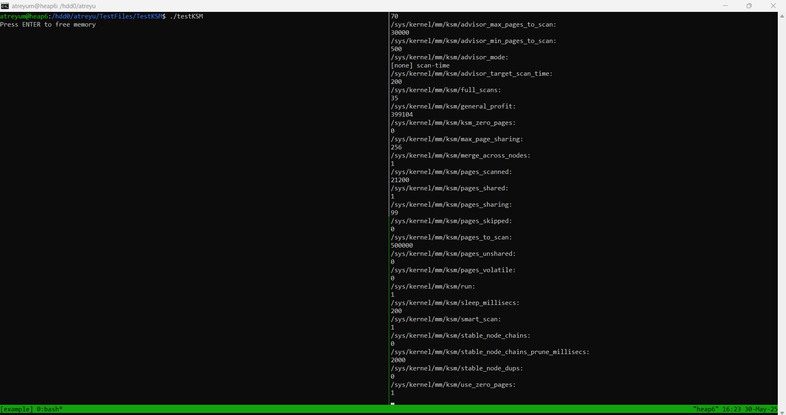

This is the readme for the tutorial. In your environment, run `./ksminit.sh`. This should output to console
```
500000
1
2
```
Let's see what happens when we run KSM in the system as-is. I've att
  
Now KSM is ready to be used. In one tmux window, run `./testKSM` to allocate 100 mergeable pages, don't free the memory yet! In the other tmux window, run `./ksmstart.sh`, then `./ksmwatch.sh` to start and observe KSM levels. This is what mine looks like:  

  

hello