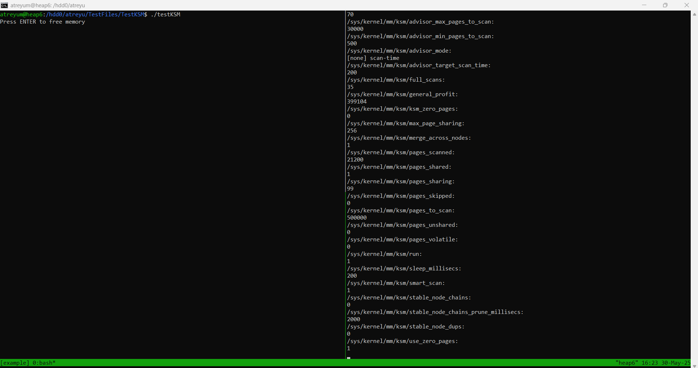
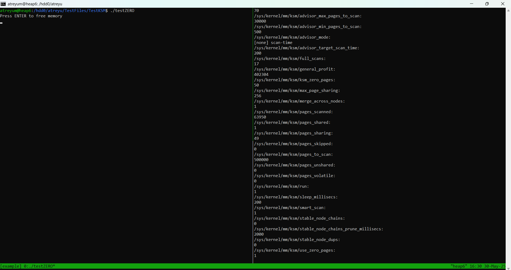
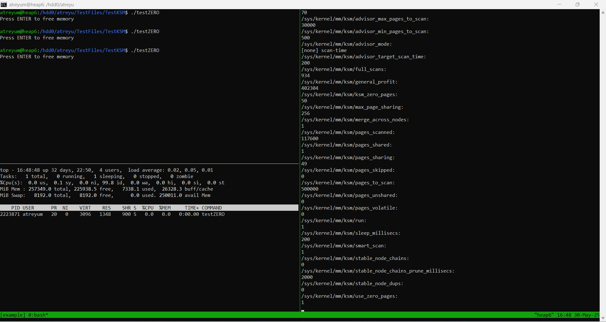

This is the readme for the tutorial. In your environment, run `./ksminit.sh`. This should output to console
```
500000
1
2
```
Let's see what happens when we run KSM in the system as-is. For this, you'll want 2 vertical windows as shown in the upcoming screenshot. 
  
Now KSM is ready to be used. In one tmux window, run `./testKSM` (made with command `gcc -o0 -o testKSM testKSM.c`) to allocate 100 mergeable pages, don't free the memory yet! In the other tmux window, run `./ksmstart.sh`, then `./ksmwatch.sh` to start and observe KSM levels. This is what mine looks like:  
  
  
Once you're able to approximately replicate this, feel free to hit Crtl+C in the window running `./ksmwatch.sh`, then run `./ksmend.sh`. Now, the two fields to pay attention to in `ksmwatch` are `pages_shared` and `pages_sharing`. You'll notice in the screenshot that `pages_shared` is 1 and `pages_sharing` is 99, which means that one page has been deduplicated 99 times, which adds up to our 100 mergeable pages!  

Now, let's see what happens when we run `./testZERO` (made with command `gcc -o0 -o testZERO testZERO.c`), which is nearly the same as `./testKSM`, except 50 of the pages it allocates are zero-pages. Here's my results:  
  

Again, once you've approximately replicated this, hit Crtl+C in the window running `./ksmwatch.sh`, then run `./ksmend.sh` to end KSM. This time, there are three fields to pay attention to in `ksmwatch`: `ksm_zero_pages`, `pages_shared`, and `pages_sharing`. You'll notice in the screenshot that `ksm_zero_pages` is 50 (due to the 50 zero-pages we allocated), `pages_shared` is still 1, and `pages_sharing` is now 49! For a full set of deduplication results, there's only one other thing we'd need, which is a denominator for deduplication ratios. For this, you can run ``` top -p `pgrep "testZERO"` ``` while `./testZERO` is running to get the RES size of the process like so:  
  

RES size is likely a good enough denominator just for this basic test. Now we have the number of duplciate pages (`pages_sharing`), the number of zero pages (`ksm_zero_pages`), and the deduplication ratio (`(pages_sharing * 4) / (process RES)`)! In the VMs example, we show how effective KSM can be for use with VMs.