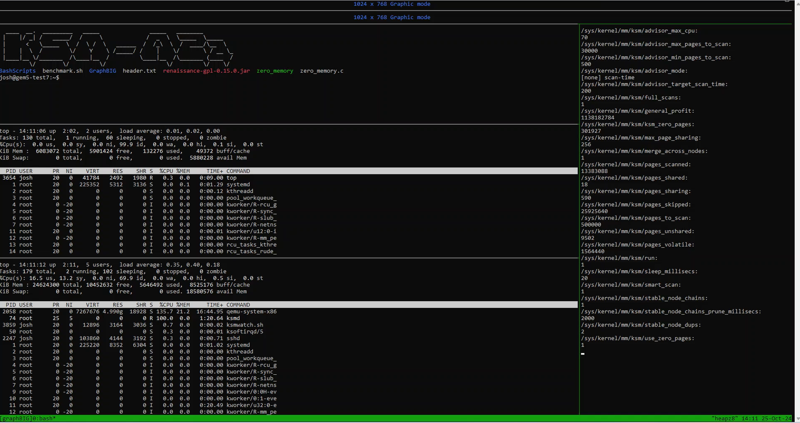
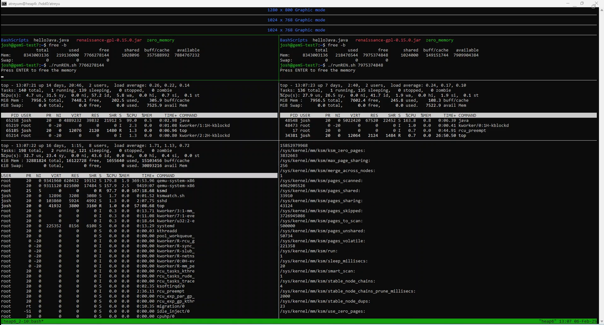

# DedupeResearch
Hello, this GitHub pertains to the results of my research revolving around memory deduplication, which is the practice of finding identical pieces of memory and storing only one copy of that memory. While there are many files and folders in this repository, there are three major folders we'll b focusing on in this readme: StaticWindow, KSM, and VMs. It's worth noting that you should install tmux in your shell environment if you haven't already, as it will be an immensely helpful tool. It's worth noting that many of the `bash` scripts are used so often, I typically include them in my environment's `.bashrc` as aliases for quicker access. Now, for a description of the following sections.  
  
The "Static Window" section is the biggest of them all, and will pertain to all code relevant to **static-window deduplication**, which is deduplicating memory by looking for identical *windows* of code, one window at a time. A *window* refers to the size of memory to be viewed, such as 64B or 4kB. For instance, if I want to see how much duplicate data exists between two files using static-window deduplication, I'd have to first specify the window (let's say 4kB, or one page) and then we would deduplicate by analyzing 4kB of data at a time. The "Static Window" section contains descriptions for essential pieces of code that can obtain necessary files and memory dumps, format memory dumps, and perform static-window deduplication. The folder also highlights the general experimentation workflow, and then extra analysis one can perform on static-window deduplication results. These extra analyses include finding the average distances between matches, where in memory matches are coming from, and other code that allow you to quickly perform two-file deduplication over entire directories.  
  
The "KSM" section is much shorter, and pertains to scripts relevant for experiments that use **KSM**, or Kernel-Same-Page-Merging, a Linux feauture that does deduplication from an OS-level. This section goes over all the scripts I've created that allow the user to quickly initialize, activate, monitor, and stop KSM. KSM itself is rather closely-tied to VMs, so you'll see that the next section will also be very helpful for dealing with KSM.  
  
The "VMs" section delves into the code that allows for both booting up and connecting virtual machines (VMs) and the general structure and hierarchy I used in my experiments. There will also be a template VM that you can use for starting. We also go into important code that allows you to essentially 'initialize' VMs for deduplication experiments, and other code that allows you to get histories of `top` and KSM outputs at differing VM levels!  
  
I hope this repository may help you in your deduplication endeavors, let's begin!  
  
  
## Static Window
This folder contains all code relating to static window experiments, using code I wrote. Everything described here will be found in the `StaticWindow` folder. I'll first go over some of the essential pieces of code, then general experiment processes. There is also an Example subfolder that has it's own dedicated walkthrough readme.  

### Essential Code

#### map_and_core
Run with `./map_and_core.sh $1 $2` where  
* $1 is a process PID  
* $2 is the output files' prefix  

Outputs both a text file named `$2_maps.txt`, where `$2` is the given prefix, containing the given process' memory mapping (obtained via `cat /proc/"$1"/maps`) and a binary memory dump file of the process called `$2.$1` where `$2` is the given prefix and `$1` is the given PID.  

#### elf
This code takes in a memory dump (specifically ELF-CORE type) file and removes all it's metadata. This is run using `./elf $1 $2` where  
* $1 is the input file
* $2 is the output file name

Outputs a copy of the memory dump stripped of all it's metadata. This code is used before running static deduplication on memory dumps, as memory dumps obtained via `gcore` or `./map_and_core.sh` will contain many bytes of metadata, offsetting the data we actually care about. This code removes all the metadata, and ensures the original memory is what's left. When doing static-window deduplication on memory dumps, do it on the files this code outputs.  

#### DedupeCheck.java
The most fundamental piece of code here, it's what actually runs static-window deduplication. This is run using `java DedupeCheck $1 [-v] $2`, where 
* $1 is the size of the window  
* `-v` is an optional verbose mode that outputs information for all matches found  
* $2 is a list of paths to binary memory dumps  

If verbose mode isn't specified, the code outputs to console the following summary deduplication information: 
```
Files:          X
Dedupe Graph:   [X.XX%, ..., X.XX%]
Unique Windows: X
Total Data:     X B
Dupe Data:      X B        
Dedupe Ratio:   X.XX%
Zero-Windows:   X B
```

Where `X` is a generic placeholder character for any number. Here's what each entry tells you:  
* `Files` is how many files were scanned  
* `Dedupe Graph` is the deduplication ratio after each file is scanned (with the final entry being the final deduplication ratio after all files)  
* `Unique Windows` is how many unique matches there were (for instance, a file with matches that only came from matching data `A`, `B`, and `C` will have 3 unique windows)  
* `Total Data` can also be interpreted as 'non-zero' data, essentially how much data was actually scanned and accounted for in all the files. This is the denominator for deduplication ratios  
* `Dupe Data` is how much duplicate (matching) data was found. This is the numerator for deduplication ratios  
* `Dedupe Ratio` is the deduplication ratio, calculated as `(Dupe Data)/(Total Data)`  
* `Zero-Windows` is how many windows containing only zeroes were found (again, these are not included in either `Total Data` or `Dupe Data`)  

However, if verbose mode **is** specified, then in addition to the summary information above, you'll receive a list of information for every match with the following format:  
```
===Discovered Match===
    Offset: X B
    Length: X B
    File: Y
    Hash: Y
===Established Match===
    Offset: X B
    Length: X B
    File: Y
    Hash: Y
```

Where `X` and `Y` are generic placeholder characters for any number or string respectively. Before explaining what each field represents, it's important to explain what "Discovered Match" and "Established Match" mean. In our code, we define a match as having two parts, an "Established match" and a "Discovered match." In later code, these are also referred to as the "source" and "copy" of a single match respectively. The "Discovered match" tells you where a complete match has been identified and the "Established match" tells you the original data that has been matched. For instance, if this code first finds a window of data in file A that is then found again in file B, that is a match whose establishment/source is from file A and whose discovery/copy is in file B. With that in mind, here's what each entry tells you:  
* `Offset` is the offset into the file  
* `Length` is the length of the match  
* `File` is the name of the file this source/copy originates from  
* `Hash` is how we hashed the data in our code for comparison  

This information is repeated for every match found in static-window analysis, and is *highly* useful for code described in the upcoming "Extra Analysis" section.
  
  
### General Experiment Process
A general experiment will have the following workflow:  
1) Start and run a process (which will have a PID referred to as `PID` from here on)  
2) Some point in the process's life, run `./map_and_core.sh PID output`, which outputs both the process's memory mapping text file (`output.txt`) and a memory dump binary (`output.PID`)  
3) Run `./elf output.PID output_P.PID`, which will remove all metadata from the `output.PID` binary, resulting in a 'parsed' file  
4) Run `DedupeCheck` with a valid window size and the `output_P.PID` memory dump, which will then finally output static window deduplication results on the processes' memory!  
  
For multiple processes, simply repeat steps 1-3 for each process and then run `DedupeCheck` with all parsed dumps listed!  
  
  
### Extra Analysis
The following sections describe additional analysis tools for parsed memory dumps, which will generally require a text file containing information from all static-window matches, which can be done through steps 1-3 above, then `java DedupeCheck $1 -v $2 >> output.txt` where `output.txt` will contain the matches information. For simplicity's sake, we'll be referring to this as a 'matches file' from here on.  
  
#### Block Analysis
This code will look at all the static window matches and return a CDF list of the number of matches within certain ranges of bytes from each other. Simply run `python3 blockanalyze.py $1` where  
* $1 is a matches file, where **deduplication was run with a 64B-sized window on a single file**
  
Outputs to console a CDF of what percent of matches are within what ranges of each other, with lines looking like this:
`2^Y B <= x < 2^(Y+1) B: 0.ZZZZ`  
  
Where `Y` is an integer from 6 to 63, `x` represents distance between 2 matches, and `0.ZZZZ` is the cumulative percentage from matches that are within that distance to each other.
  
#### Parse Matches
This is code is typically used for verifying static-window deduplication output by reporting back how many matches are aligned with a certain user-determined number, or the same size as the user-defined number. For instance, if the user inputs `64`, it reports information about how many matches are 64B-aligned or 64B in size. Run the code using `java ParseMatches $1 $2 $3` where  
* $1 is the window-size/alignment
* $2 is a matches file
* $3 is an optional output file name

The output will be statistics that report how many matches were aligned or of a certain size. Here's what the output will look like, where $1 is the window-size you gave and `X` is a generic placeholder for numbers:  
```
$1 B-Aligned-Matches: X
Total Matches: 		X
Average Aligned-Match Size: X.XX B
Average Match Size: X.XX B
$1 B-Aligned & $1 B-Length Matches Contained THROUGHOUT: X
Aligned/Total Ratio: X.XX%
```
  
#### Map Matches
One of my favorite pieces of code I've written, this can determine what percent of `DedupeCheck` matches come from what memory regions (including heap, stack, shared libraries, anonymous, etc)! Run using `java MapMatches [--assume-parsed] {filename.type: program_headers.txt maps.txt} matches.txt` where
* `matches.txt` is a matches file
* `{filename: program_headers.txt maps.txt}` is repeated for each unique file present in `matches.txt` **(yes, include the curly braces and semicolon)**
  * `filename`: a filename present in `matches.txt`
  * `program_headers.txt`: a text file of program header information for `filename`, produced by running `readelf -l` on `filename`
  * `maps.txt`: a text file of memory mapping information for `filename`, aka the text file output from `map_and_core.sh`
* `[--assume-parsed]` specifies that the files in `matches.txt` are outputs of our `elf` code, meaning they have no metadata. This means the file offsets referred to in `matches.txt` will differ from the file offsets in each `program_headers.txt`, which can result in inaccurate mapping to the memory areas in `maps.txt` if this option is not specified  
  
This outputs to console lots of information, but the most important is that pertaining to matches. There's two sections, one for matches whose source and copy halves **do not** share the same memory origin (aka, mismatches), and one for those matches with halves that **do** share the same memory origin. For mismatches, we have the following format for each unique pairing of source-copy:  
```
[COPY]   Copy-Filename : Copy-Mapname [Copy-Flags]
    [SOURCE] Source-Filename : Source-Mapname [Source-Flags]
    [TOTAL]  Matched-Bytes (%-of-mismatches)
```
You can see this tells us the file and memory-mapping name for both source and copy, as well as both the amount of bytes matched and what percent of mismatches that accounts for. For example:  
```
[COPY]   file1.5238 : libc10.so [RW ]
    [SOURCE] file1.5238 : [heap] [RW ]
    [TOTAL]  64 Bytes (5.00% of mismatches)
```

Tells us there was a 'mismatch' who's source data was from `[heap]` and who's copy was from `libc10.so`, and that this mismatch took place in the scope of a single file, `file1.5238`. There were 64 bytes worth of these mismatches, and that accounts for 5% of all mismatches.  
  
For matches, we have the following format for each unique pairing of filename and memory-mapping:  
`Source-Mapname [Source-Flags] : Matched-Bytes (%-of-matches)`
This tells us the memory-mapping name of the source's data, as well as both the amount of bytes matched and what percent of matches that accounts for. For example:

`libc10.so [RW ]: 44992 Bytes (2% of matches)`
Tells us that there are 44992 bytes worth of matches that are matching data originating from `libc10.so` and that this accounts for 2% of all matches found.
  
After all that, there is a small bit of final information that may be useful for calculating other things as well. These final two numbers reported are simply the number of bytes duped (good for verifying against your deduplicated statistics summary) and the number of bytes worth of mismatches (allows you to calculate what percent of all matches were actually mismatches).  

### Folder-Wide Deduplication
To quickly do deduplication over an entire folder without listing every file, you can use either `DedupeCheckFull.sh`, `DedupeCheckList.sh`, or `FastFull.sh` (if you have fastcdc installed)

#### DedupeCheckFull
Run with `./DedupeCheckFull.sh $1 $2` where  
* $1 is the window size  
* $2 will be the directory to do static-window deduplication on  

This code outputs all possible static deduplication results up to two files in a directory. So, for a directory named "example" that contains files A, B, C, running `./DedupeCheckFull.sh 4096 example/` outputs results you'd obtain from `java DedupeCheck 4096 [files]` for [(A), (A, B), (A, C), (B), (B, C), (C)]  

#### DedupeCheckList
Run with `./DedupeCheckList.sh $1 $2 $3` where  
* $1 is the window size  
* $2 will be the base file to compare all others too  
* $3 will be directory to do static-window deduplication on  

This code outputs static deduplication summaries for a base file compared to all other files in a directory. For instance, if we run this on a directory named 'example' containing files A, B, C, using the command: `./DedupeCheckList.sh 4096 A example/`, this outputs results you'd obtain from `java DedupeCheck 4096 [files]` for: [(A), (A, B), (A, C)]  

#### Parse Static
This code takes in a text file containing the output of `DedupeCheckFull.sh` or `DedupeCheckList.sh` and converts readings into a CSV file, which is very useful for getting a folders' worth of data quickly onto a spreadsheet! Run using `java ParseStatic $1 $2 [-l/-f] $3 $4` where
* $1 is the text file of deduplication result outputs
* $2 is the key, which can be F for Files, DG for Dedupe Graph, UW for Unique Windows, TD for Total Data, DD for Dupe Data, DR for Dedupe Ratio, or ZW for Zero-Windows
* `[-l/-f]` indicates if if the input file was made using DedupeCheckList (`-l`), or DedupeCheckFull (`-f`)
* $3 is the number of unique memory dumps
* $4 is an optional output file name

#### FastFull
Run with `./FastFull.sh $1` where  
* $1 will be directory to do FastCDC deduplication on  

This code outputs all possible FastCDC deduplication results up to two files in a directory. So, for a directory named "example" that contains files A, B, C, running: `./FastFull.sh example/` would output FastCDC deduplication results for: [(A), (A, B), (A, C), (B), (B, C), (C)]. You can modify the parameters of the FastCDC deduplication inside the script.  

## KSM
This section pertains to strictly KSM code and experiment processes, and all needed scripts can be found in the `KSM` folder. I'll first go over the essential scripts and then general experiment processes. It's important to note that your Linux kernel will be to be at least version 2.6.32, though later versions will be needed for fields such as `ksm_zero_pages`, which are also crucial for meaningful deduplication data. It's also worth noting that while VMs can be used for both static window and KSM, you will definitely be using them the most for KSM. The included VM will already be up-to-date. For future reference, it's important to know there is commonly a hierarchy of VMs, where KSM is run in the highest level (LVL-1) and merging pages in the lower-level VMs (LVL-2 VMs). There's also an Example subfolder containing it's own dedicated readme.  

Some helpful links for learning:  
* https://docs.kernel.org/admin-guide/mm/ksm.html  
* https://docs.kernel.org/mm/ksm.html  

### Essential Scripts
#### ksminit
Initializes KSM to not merge zero-pages, scan 500,000 pages at a time, and ensures KSM isn't running. Run with `./ksminit.sh`  

#### ksmstart
Tells KSM to begin merging pages. Run with `./ksmstart.sh`  

#### ksmwatch
Prints out all KSM contents to the screen every second, and can be ended with Ctrl+C. Run with `./ksmwatch.sh`  

#### ksmend
Tells KSM to stop merging pages. Run with `./ksmend.sh`  

#### ksmls
Prints out all KSM contents to the screen only once. Run with `./ksmls.sh`  

### General Experiment Process
For KSM experiments, we're usually interested zero-data, duplicate data, VM resident-size (RES), and process RESs. When it comes to connecting what KSM reports to our static-window experiments, `ksm_zero_pages` is the same as `Zero-Windows` and `pages_sharing` is the same as `Duped Data`. Of course, KSM reports pages and our code reports bytes. The conversion is simple, just multiple both the KSM fields with 4096. To effectively capture all the data, we'll need some windows holding KSM data, other windows holding `top` information, and other windows holding VM information. For this reason, tmux is a very important tool for easily having multiple shell environments on screen. Here's an image that show my general tmux setup for 1 VM:


  
It's a bit tricky to see, but there are 2 small windows at the very top which are running the boot-up for the LVL-1 and LVL-2 VMs (more on that later). After that, on the far right there's a window showing `ksmwatch` information (which tells us the zero data and duped data), and the 3 windows to the left (from top to bottom) is the LVL-2 VM's process running, LVL-2 VM's `top` information (which tells us the process RES), and LVL-1 VM's `top` information (which tells us the VM RES). Here's another screenshot showing the setup for 2 VMs:


  
Similarly, there are 3 small windows at the very top which are running the boot-up for the LVL-1 and LVL-2 VMs (more on that later). Below that, the 2 windows left-to-right are the LVL-2 VMs. Under that, there are the 2 windows for each LVL-2 VM's `top` information. Finally, left-to-right, there are windows showing LVL-1 VM's `top` information and another showing `ksmwatch` information.  

As for the general process of an experiment:
1) Set up a LVL-1 VM environment for KSM to run from
2) Set at least 1 LVL-2 VM environment for KSM to monitor
3) Set up processes that will run in the LVL-2 environment(s)
4) In LVL-2 VMs run `./zero_memory` (explained in VM section)
5) In your LVL-1 VM, the KSM cycle is:  
   a. `./ksminit.sh` will initialize KSM values (only need to do once per active tmux session)  
   b. `./ksmstart.sh` to start running KSM  
   c. `./ksmwatch.sh` to observe KSM values while the process runs  
   d. `./ksmend.sh` to stop running KSM when you're satisfied  

## VMs
VMs are very important for distributing your work, and are very crucial for KSM experiments. All code listed here will be found in the `VMs` folder. There is a zip file containing a bare-bones version of the VM image file I used for my experiments, and ***the username and password for the VM is josh and admin respectively.*** you'll need to increase the disk-space, RAM, and CPUs as needed for your own devices. After tailoring the IMG file to your needs, you can use this as a LVL-1 VM and scp a copy of that same IMG file into the VM itself to create LVL-2 VMs. There are 2 steps to using a VM: booting it up, then scp'ing into it. We'll first go over the essential code for VMs and certain KSM experiments.  

### Hierarchy
The following code section goes on the following assumption of VM tree hierarchy:  
```
              Host  
            /      \  
          /          \  
         /            \  
      KSM-A           KSM-B  
     /      \        /     \  
   A2a      A2b    B2a     B2b  
```

Where KSM-A and KSM-B are LVL-1 VMs, and A2a, A2b, B2a, and B2b are LVL-2 VMs. Designated scripts for both booting up each VM and connecting to them have already been provided. You'll notice the following hierarchy of MONITOR and NET values in each setup script:  
```
MONITOR/NET Ports:  
Host  
|- KSM-A=10023/1235  
|  |- KSM-A2a=10024/1235  
|  |- KSM-A2b=10025/1236  
|  
|- KSM-B=10026/1237  
|  |- KSM-B2a=10027/1237  
|  |- KSM-B2b=10028/1238  
```

The subfolders in this VMs folder is organized based on where each script should be located. The Host folder contains all code that should be located in the Host machine, the LVL-A1 folder corresponds to code that should exist in KSM-A, LVL-B1 correlates to KSM-B, and LVL-2 correlates to code that can exist in any LVL-2 VM.  

### Essential Code
#### Setup Scripts
These scripts correlate to booting up a VM. If you're looking to change a VM's fields such as `MEMSIZE`, `NUMCPUS`, `IMG`, `MONITOR`, `NET`, `LOG`. Run each script using `sudo ./setup-*.sh` where `*` is a substitute character.

#### Connecting Scripts
These scripts are what actually connect to the VM once they're fully booted up. Run each script using `./connect-*.sh` where `*` is a substitute character

#### Zero Memory
This code allocates a user-specified number of bytes and fills them with zeroes. Run using `./zero_memory $1` where 
* $1 is the number of bytes to zero-out

This is especially helpful as these can contain a great deal of nonzero freed memory at any given. Typically, you would run this code on a VM you're about to measure, zeroing out either all the available memory or all the free memory (both amounts can be seen in that VM's `top`)

#### Capture Scripts
These scripts are capable of capturing `top` and `ksmwatch` information pertaining to VMs of interest (assuming the same connecting addresses, usernames, and passwords as the hierarchy above describes). Remember, what folder they exist in should tell you what VM you should locate them in for your hierarchy.  
  
Running `./lvl*_capture.sh $1 $2`, where `*` is a substitute character and
* $1 is the process ID of either VM A2a or B2a (depending on which script you're running)
* $2 is the process ID of either VM A2b or A2b (depending on which script you're running)
will allow you to see the final `ksmwatch` and `top` information pertaining to the LVL-2 VM processes of interest! This assumes KSM is already running in your LVL-1 VM. These will be outputted to files called `LVL-*-ksm.txt` and `LVL-*-top.txt`  
  
Running `./lvl*_capture_h.sh $1 $2 $3` where `*` is a substitute character and
* $1 is the process ID of either VM A2a or B2a (depending on which script you're running)
* $2 is the process ID of either VM A2b or A2b (depending on which script you're running)
* $3 is the time in seconds between capture intervals
will allow you to see the history of `ksmwatch` and `top` information pertaining to the LVL-2 VM processes of interest! This assumes KSM is already running in your LVL-1 VM. These will be outputted to files called `LVL-*-ksm.txt` and `LVL-*-top.txt`  
  
Running `./lvl2_top_capture.sh $1` where
* $1 is the LVL-2 VM PID of interest
will output the final filtered reading of the LVL-2 VM's `top` information before the process ends
  
Running `./lvl2_top_capture.sh $1 $2` where
* $1 is the LVL-2 VM PID of interest
* $2 is the time in seconds between capture intervals
will output the filtered reading of the LVL-2 VM's `top` information every specified interval before the process ends

To initialize and connect via SSH into a VM, here's my general process:
1) Create and attach to a tmux session using "tmux new -s ExampleName", "tmux a"
2) Create 2 vertical windows
3) In one window, call the correct `setup-*.sh` script to begin booting up the VM
4) In another window, call the respective `connect-*.sh` script. This won't allow for a connection until the VM has fully booted up. In my setup I usually had to wait up to 5-10 minutes for a complete LVL-2 boot-up.
5) Once the VM has finished booting up, you'll be able to SSH in!  

## Other Folders
All other folders pertain to more specific experiments that we repeatedly visited throughout our research, each folder contains a readme document to help you navigate them. Happy deduplicating!