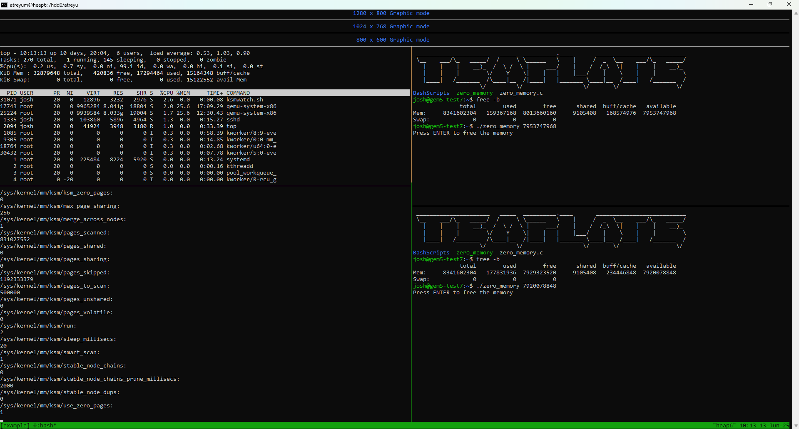

# VMs
This is a relatively short walkthrough of how I have done experiments with VMs in the past. I've attached a compressed file of the original VM image, split into mutliple files. To get the uncompressed VM image, run:
```
cat ubuntu20_template/ubuntu20_template.img.xz.part-* > ubuntu20_template/ubuntu20_template.img.xz
xz -d ubuntu20_template.img.xz
```
While commands like `ls -lh` will show that the image is 80G, that is only due to errors in the .img file's header, to see the true size use commands like `du -h`.  
  
It's important to stress again just how **necessary** a service like tmux is for the following tutorial, and other experiments you hope to conduct in the same way. For this tutorial, we're simply going to show what KSM looks like when deduplicating VMs. To start, I have a tmux session consisting of 4 windows as shown below:  
  
  
The topmost window can be ignored, but the window below that (reads `800 x 600 Graphic mode`) is the window where I ran `sudo ./setup-template.sh`, which is code that boots up the template VM. The bottom-left window is the shell from my host machine, and the bottom-right window is the inside of the booted-up VM. To get to this setup, run `sudo ./setup-template.sh` in the corresponding window (**but be sure to change the path for the IMG field in setup-template.sh, and other values as needed**). It will take time to fully boot up the VM (around 5-8 minutes on my server). You will know that the VM is booted once you can run `./connect-template.sh` in the bottom-right window and it asks for the VM user's password. If the connection is successful, you'll be ssh'd into the VM! **The username and password for the template VM are josh and admin respectively.** In that same window you ran `./connect-template.sh`, type `cls` and hit enter. You'll be shown a header and the listing for your current directory! This is command is an alias for the `cls.sh` script in this GitHub, with the header itself being the only difference.  

We will already be able to see that KSM willbe able to detect deduplicate data! In your host shell, use the same sequence of scripts from the KSM tutorial to start and run KSM:
```
ksminit
ksmstart
ksmwatch
```

In my host, I have these KSM scripts as aliases with the same name, hence the lack of `./` before each call. While my KSM readings will likely differ from yours, after letting both KSM and the VM sit idly for about five minutes, my KSM readings show that:
 * `ksm_zero_pages` levels to 33,726 pages
 * `pages_sharing` levels to roughly 400,600 pages
  
If you open another tmux window for your host and type `top`, you'll see information for your qemu process. Here's what my environment looks like:  
  
  
For deduplication, we're most interested in the `RES` field. For my idle VM, I get 5.419G. For this idle VM, thats a deduplication ratio of approximately 28.2% (`(pages_sharing in KB)/(process RES in KB)`), not bad! However, a lot of that deduplication could be from memory that isn't being used at all, like idle RAM that, while nonzero, isn't being utilized. To address this, let's first shut off KSM in our host by running the `./ksmend.sh` script. Now, turn our attention to the VM.  

You'll see inside the VM that there is an executable labelled `zero_memory`. This does exactly what you think, allocates a specified amount of memory and fills it with zeroes. In most VM experiments, we allocate either the amount of free or available memory. We can determine the size of that memory by running `free -m` in our VM. For mine, I get 7544MB of available memory, and 7552MB of free memory (which is not typical, usually free is smaller than available). However, `zero_memory` expects the amount of memory to be in bytes, so let's run `free -b` instead. For this tutorial, I'll be calling `./zero_memory` on the available memory (which for me was 7911399424 bytes). Again, your numbers may be different (in fact they certainly will be if you changed the `MEMSIZE` field in `setup-template.sh`).  

This will take just a few minutes to allocate all those zeroes, but it will display a `Press ENTER to free the memory` message once finished. In your host, again run: 
```
ksmstart
ksmwatch
```

If you pay attention to the `RES` field of the qemu process in your `top` window, you'll see it drasticaly decrease. This is because KSM is working! It automatically removes zero-pages from the `RES` size of the VM as well, very handy! After letting KSM run for a few minutes, my readings show that:
 * `ksm_zero_pages` levels to 1,952,991 pages
 * `pages_sharing` levels to roughly 24,300 pages
 * `RES` is 618,120 KB
  
This gives us an approximate deduplication ratio of 15.7%, a difference of 12% from our first reading. Let's run `./ksmend.sh` in our host now, and free the memory in our VM. Let's see what happens when we do this with two VMs! The scripts `setup-template2.sh` and `connect-template2.sh` will be used now in the same way we used `setup-template.sh` and `connect-template.sh`. The only thing you'll need to do is run `cp ubuntu20_template.img ubuntu20_template2.img` and change the setup script as needed. Here's how I structured my environment:  
  

You can see I've already started `./zero_memory` on both of the VMs. Using the same process as before, where we wait for zeroing to finish for both VMs, we will now run KSM in the host. After letting KSM run for a few minutes, my readings are:
 * `ksm_zero_pages` levels to 3,920,459 pages
 * `pages_sharing` levels to roughly 72,800 pages
 * `RES` sizes are 603,640 KB and 570,048 KB

 Combining the `RES` sizes, this gives us a deduplication ratio of 24.8%, surpassing our original reading! This has been the a tutorial showing the basics of VMs and KSM. We encourage you to continue experimenting! 
  

 